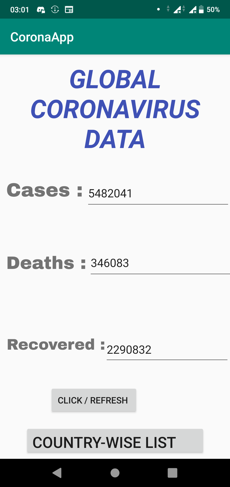
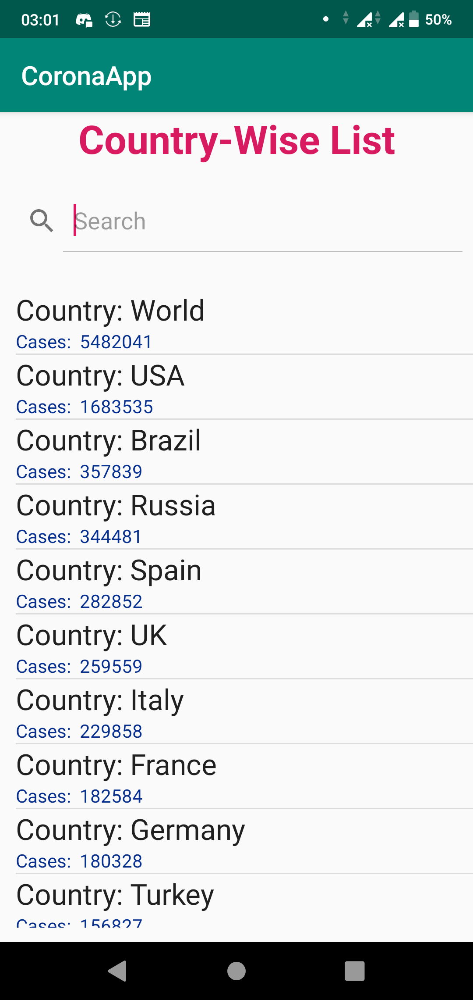
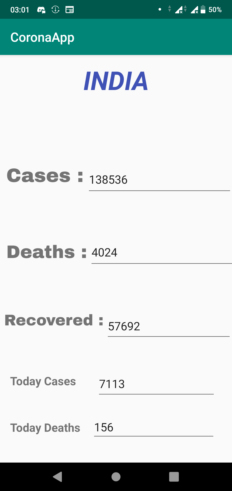

# COVID-19-DataApp
This app displays the Coronavirus data globally and also displays data of each country as well.

API for live information about COVID-19

GET https://coronavirus-19-api.herokuapp.com/all -> global info

GET https://coronavirus-19-api.herokuapp.com/countries -> all countries info

GET https://coronavirus-19-api.herokuapp.com/countries/{countryName} -> country specific information

The app displays the covid-19 data of each country indvidually in a list-view format. Thus, the actual data of a country can also be viewed by clicking on the list-view item. 

Used Volley Library to parse JSON url into String format and then display the data into the list and the textbox. 

# Screenshots of the App 
								  						 

